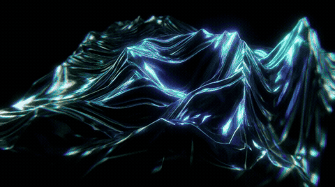
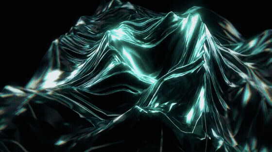
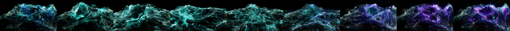

# splatmorph

Generate seamless loops between images using 3D Gaussian morphs.



*A 19-second loop generated from nine AI-created still images. In this run,
loop closure was bit-exact and scene-arrival PSNR exceeded 104 dB.*

---

`splatmorph` converts each image into approximately 1.2 million image-aligned
3D Gaussians using Apple's [SHARP](https://github.com/apple/ml-sharp) monocular
model. Gaussian positions follow quadratic Bézier paths derived from
optimal-transport correspondences. A displacement field is applied during the
crossover to reduce visible transition artifacts.

Related transport costs are used at several stages of the pipeline:

| stage | purpose | method |
|---|---|---|
| membership | filter candidate images | agreement between transport isolation and perceptual distance |
| ordering | select the scene sequence | shortest Hamiltonian cycle over pairwise transport cost |
| pacing | allocate frames per transition | frame count proportional to transport cost |
| pairing | compute splat correspondence | banded entropic Sinkhorn over position, elevation, appearance, and neighborhood context |
| trajectory | interpolate splat positions | displacement interpolation and Bézier overshoot scaled by correspondence strain |

> [!IMPORTANT]
> `splatmorph` is an experimental research tool, not an Apple project and not a
> reimplementation of SHARP. The repository includes an unmodified, pinned
> snapshot of Apple's official SHARP research code for reproducible installation.

## Quickstart

```bash
git clone https://github.com/AmeerJ97/splatmorph && cd splatmorph
python3.13 -m venv .venv
source .venv/bin/activate
python -m pip install --upgrade pip
python -m pip install ./vendor/ml-sharp
pip install -e packages/splatmorph-transport -e packages/splatmorph-fields \
            -e packages/splatmorph-engine -e packages/splatmorph

splatmorph two A.png B.png -o loop.mp4 --gif      # one looping morph
splatmorph chain ./images -o chain.mp4            # the full pipeline
splatmorph chain ./images --wave                  # inverted elevation matching
```



The first SHARP inference downloads Apple's model checkpoint unless `--weights`
is supplied. SHARP prediction supports CPU, CUDA, and MPS, but Splatmorph's
`gsplat` renderer requires an NVIDIA CUDA GPU. The transport/field libraries and
the CPU verification suite do not require SHARP or a GPU. See
[Reproducing and validating](docs/REPRODUCIBILITY.md) for the exact checks.

## Wave mode

`--wave` inverts the elevation component of the matching cost so that peaks are
paired with troughs. It can add a vertically mirrored counterpart for each
scene before optimizing the chain order. In the run shown here, five scenes
were placed directly adjacent to their mirrored counterparts.



## Verification

Every render checks itself and prints the verdict (add `--strict` to return a
nonzero exit status when a gate fails):

- **loop exactness** — ≥ 85 dB PSNR for two-image loops; ≥ 80 dB closure for
  chains (the showcased two-image runs closed bit-exactly)
- **endpoint purity** — pure-scene PSNR gates are ≥ 50 dB for two-image
  endpoints and ≥ 80 dB for chain arrivals; the showcased run reached ≥ 104 dB
  (symmetric two-set formulation: one transport plan, both barycentric maps,
  and scene-owned splat attributes)
- **boundary quietness** — every chain join must be quieter than the ordinary
  motion of the segment it opens
- **solver convergence** — Sinkhorn marginal error ≤ 1e-3

CI exercises scaled-down versions of the same mathematical invariants using
synthetic scenes on CPU.

## The packages

Each stage ships as an independent library:

| package | what it is |
|---|---|
| [`splatmorph-transport`](packages/splatmorph-transport) | banded entropic OT for dense grid correspondence: neighborhood-context costs, trajectory-band position barrier, anti-pairing, bidirectional barycentric maps |
| [`splatmorph-fields`](packages/splatmorph-fields) | depth-derived field analysis: relative elevation, glare-fused shard displacement, curl-of-depth flow |
| [`splatmorph-engine`](packages/splatmorph-engine) | the symmetric two-set morph engine: Bézier transport trajectories, choreography layers, gates |
| [`splatmorph`](packages/splatmorph) | command-line pipeline for membership, ordering, pacing, and rendering |
| [`vendor/ml-sharp`](vendor/ml-sharp) | unmodified snapshot of Apple's official SHARP research runtime |

Details of the technique: [docs/TECHNIQUE.md](docs/TECHNIQUE.md).

## Attribution & licensing

- splatmorph's own packages are MIT.
- The morphing runs on **Apple's SHARP** model
  ([arXiv 2512.10685](https://arxiv.org/abs/2512.10685)). `vendor/ml-sharp` is
  an unmodified snapshot of Apple's official repository, pinned to upstream
  commit `1eaa046834b81852261262b41b0919f5c1efdd2e`; see its
  [provenance record](vendor/ml-sharp/UPSTREAM.md) and [Apple software
  license](vendor/ml-sharp/LICENSE).
- The **SHARP model weights are not distributed here**. They remain subject to
  [Apple's model license](vendor/ml-sharp/LICENSE_MODEL), which limits them to
  non-commercial scientific research and academic development.
- Rendering via [gsplat](https://github.com/nerfstudio-project/gsplat) /
  [3D Gaussian Splatting](https://arxiv.org/abs/2308.04079).

## Status

Experimental research release. The media in this README was generated by the
pipeline. CPU unit gates run in GitHub Actions, while full SHARP inference and
rendering must be validated on an NVIDIA machine using the documented
[GPU smoke test](docs/REPRODUCIBILITY.md#gpu-end-to-end-smoke-test). Open
directions include a browser (three.js) player for exported splat trajectories,
Gromov-Wasserstein pairing, and spline chains that flow *through* scenes instead
of pausing at them.
